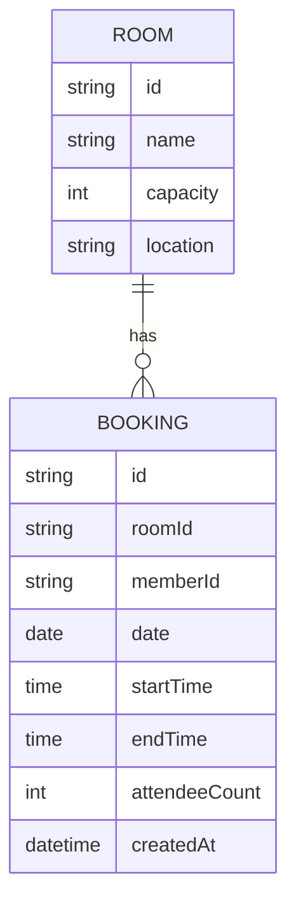

# Domain Model

Two entities: the office's fixed set of rooms, and the bookings members make
against them. A booking always belongs to exactly one room and one member.

`ROOM` rows are seeded at deployment and never created, edited or removed
through the app. `BOOKING.memberId` is the signed-in caller who made it —
resolved from the gateway assertion, never a client-supplied value — and is
what lets a member see and cancel only their own bookings. A booking's
`startTime`/`endTime` and `date` together give the time range two bookings on
the same room are checked against for overlap.