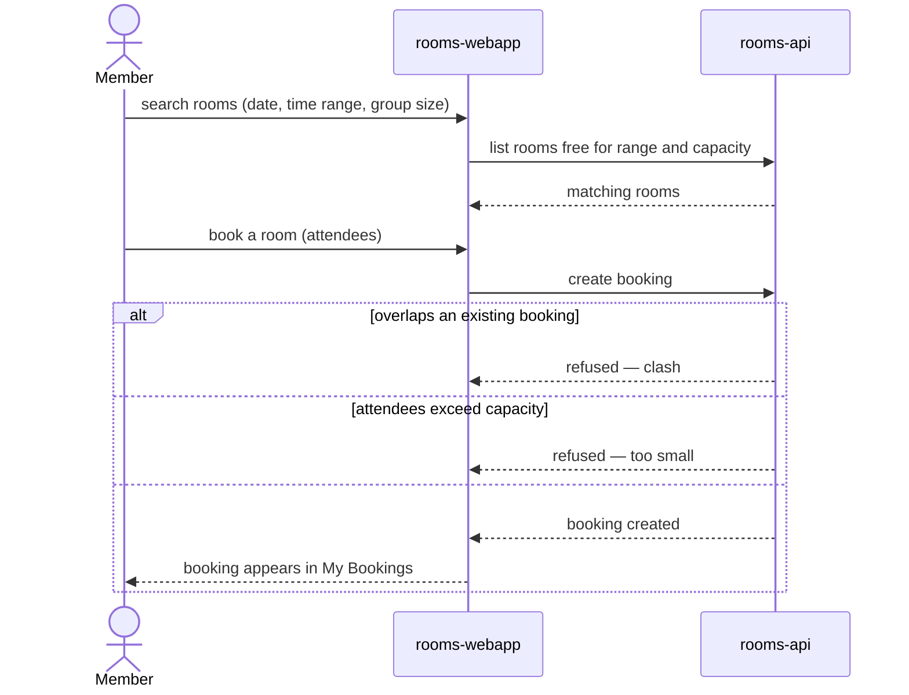

# Book a Room

A Member searches for a room that is free for a time range and fits their
group, then books it — with the API refusing a clash or an oversized group
before anything is reserved.

```mermaid
sequenceDiagram
    actor Member
    participant roomswebapp as rooms-webapp
    participant roomsapi as rooms-api

    Member->>roomswebapp: search rooms (date, time range, group size)
    roomswebapp->>roomsapi: list rooms free for range and capacity
    roomsapi-->>roomswebapp: matching rooms
    Member->>roomswebapp: book a room (attendees)
    roomswebapp->>roomsapi: create booking
    alt overlaps an existing booking
        roomsapi-->>roomswebapp: refused — clash
    else attendees exceed capacity
        roomsapi-->>roomswebapp: refused — too small
    else
        roomsapi-->>roomswebapp: booking created
        roomswebapp-->>Member: booking appears in My Bookings
    end
```

