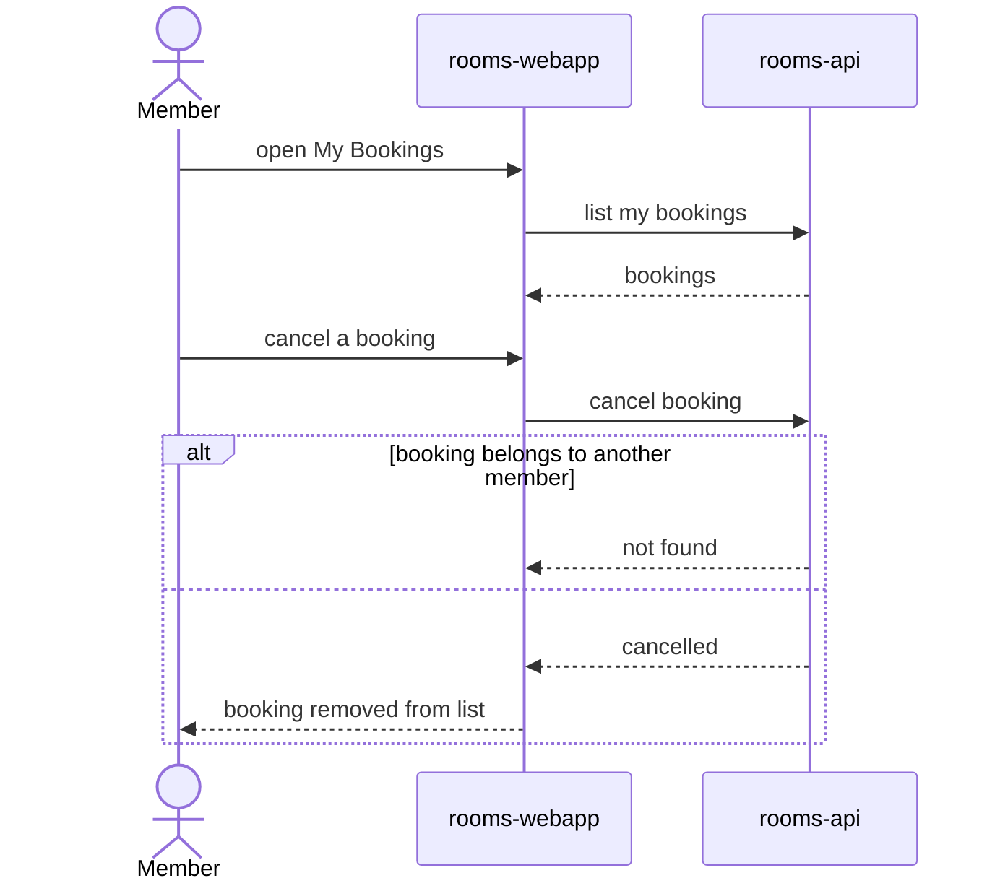

# Cancel a Booking

A Member cancels a booking they made, releasing the room; the API refuses a
cancel attempt on a booking somebody else made.

```mermaid
sequenceDiagram
    actor Member
    participant roomswebapp as rooms-webapp
    participant roomsapi as rooms-api

    Member->>roomswebapp: open My Bookings
    roomswebapp->>roomsapi: list my bookings
    roomsapi-->>roomswebapp: bookings
    Member->>roomswebapp: cancel a booking
    roomswebapp->>roomsapi: cancel booking
    alt booking belongs to another member
        roomsapi-->>roomswebapp: not found
    else
        roomsapi-->>roomswebapp: cancelled
        roomswebapp-->>Member: booking removed from list
    end
```

